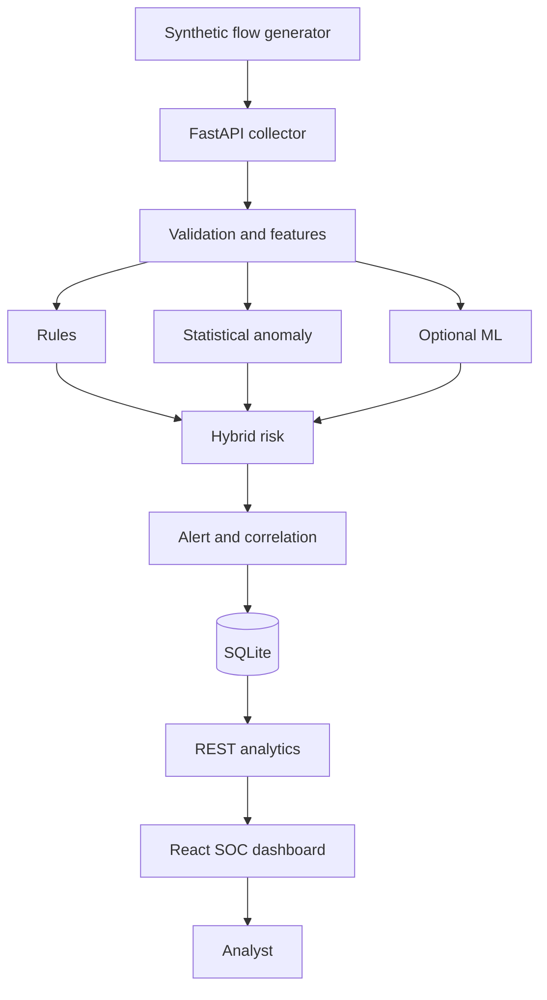

# System Architecture and Database Design

## Component responsibilities

1. **Synthetic Traffic Generator** creates reproducible, labeled flow rows with RFC 5737 addresses; it never emits packets.
2. **Flow Collector** is the authenticated `POST /api/flows` contract and duplicate boundary.
3. **Feature Extractor** normalizes fields, validates endpoints/protocol, and derives rates/ratios.
4. **Rule Engine** produces deterministic reasons for seven configured patterns.
5. **Anomaly Detector** compares five behavior features to normal Z-score, IQR, standard-deviation, and moving-mean baselines.
6. **ML Model** optionally provides supervised probability; logistic and Isolation Forest models are retained for comparison.
7. **Risk Engine** fuses enabled evidence with explicit weights and assigns classification/severity.
8. **Alert/Correlation Engines** create triage objects and group same-source/type alerts in a time window.
9. **Security Database** persists evidence, workflow state, notes, model output, rules, and audit events.
10. **API/Dashboard** provide investigation context. React polls every five seconds, the simplest reliable beginner option.
11. **Analyst** validates context and resolves/escalates; the system never claims an anomaly is automatically an attack.

## Relational design

- `NETWORK_FLOWS(flow_id PK, timestamp, endpoints, ports, protocol, packet/byte/duration/connection/flag statistics, rates, risk_score, classification, scenario, raw_json, created_at)` is the immutable observation.
- `ALERTS(alert_id PK, flow_id FK, rule_id, severity, description, risk_score, status, scores/context/timestamps)` has many-to-one relation to flows. The status check is enforced by API transitions.
- `RULES(rule_id PK, rule_name, description, severity, threshold JSON, enabled, updated_at)` is the configurable signature registry.
- `INCIDENT_NOTES(note_id PK, alert_id FK, note, created_at)` is many-to-one to alerts.
- `MODEL_RESULTS(result_id PK, flow_id FK, model_name, prediction, score, created_at)` preserves optional ML evidence.
- `AUDIT_LOGS` records modifying actor/action/entity/time.

Foreign keys cascade dependent alert/model/note evidence if an observation is intentionally deleted. Indexes support flow time/source lookups, alert status/time, source/type correlation, alert notes, and flow model results. SQLite is adequate for a single-student demonstration; PostgreSQL plus migration tooling is appropriate for concurrent production use.

## Trust boundaries and failure handling

Untrusted JSON crosses the API boundary and is validated before feature engineering. SQL uses parameters. API errors reveal no trace. Duplicate IDs return 409. An unavailable ML artifact disables only ML, retaining 60/40 rule/anomaly detection. Empty baseline data is rejected; the application factory supplies a documented synthetic fallback only when the generated CSV is absent. The frontend is not authoritative: status rules, role checks, and input limits are server-side.
